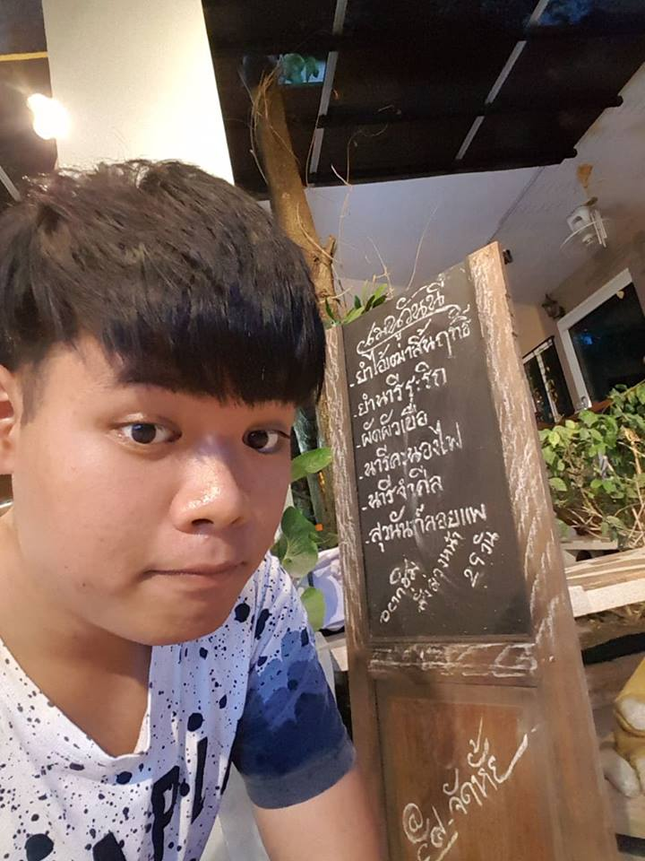

 ## 💸💸💸 เลขรางวัลจับฉลากรัฐบาล 2561-2556 💸💸💸
 ## เกี่ยวกับโปรเจค
  &nbsp;&nbsp;&nbsp;&nbsp;&nbsp;&nbsp;&nbsp;&nbsp;&nbsp;&nbsp;ศึกษาและวิเคราะห์ผลเลขรางวัลจับฉลากรัฐบาลตั้งแต่ปี2556-2561 เพื่อดูตัวเลขรางวัลที่ถูกบ่อยที่สุด
 ## แหล่งที่มาของข้อมูล
  &nbsp;&nbsp;&nbsp;&nbsp;&nbsp;&nbsp;&nbsp;&nbsp;&nbsp;&nbsp;https://horoscope.thaiorc.com/lottery/stats/lotto-years5.php
 ## สถิติเลขหน้า3ตัวท้าย
  เลขหน้า3ตัวในหลักร้อยมีเลขที่ออกมากที่สุดคือเลข[1]ซึ่งมีจำนวนครั้งที่ออกทั้งหมด57ครั้ง และมีเลขที่ออกน้อยที่สุดคือเลข[9]ซึ่งมีจำนวนครั้งที่ออกทั้งหมด0ครั้ง
  เลขหน้า3ตัวในหลักสิบมีเลขที่ออกมากที่สุดคือเลข[0,5,6,9]ซึ่งมีจำนวนครั้งที่ออกทั้งหมด26ครั้ง และมีเลขที่ออกน้อยที่สุดคือเลข[1]ซึ่งมีจำนวนครั้งที่ออกทั้งหมด20ครั้ง
  เลขหน้า3ตัวในหลักหน่วยมีเลขที่ออกมากที่สุดคือเลข[6,8]ซึ่งมีจำนวนครั้งที่ออกทั้งหมด31ครั้ง และมีเลขที่ออกน้อยที่สุดคือเลข[9]ซึ่งมีจำนวนครั้งที่ออกทั้งหมด14ครั้ง
 
 ## สมาชิก23.7
 | | รหัสนักศึกษา        | ชื่อ-นามสกุล | Github |
|:-:| :-------------: |:----------:|:--------:|
|  | 61070098    | นายนรวิชญ์ มานะพัฒนานุกุล | [norrawit](https://github.com/norrawit) |
|  | 61070256    | นายอนาวิล บางเทศธรรม | [Anawin](https://github.com/it61070256) |
|  | 61070270    | นางสาวอารยา ทองเล็ก | [Arayaoil](https://github.com/ArayaThongleg) |
 ## อาจารย์ที่ปรึกษา
 - รศ.ดร. โชติพัชร์ ภรณวลัย
  &nbsp;&nbsp;&nbsp;&nbsp;&nbsp;&nbsp;&nbsp;&nbsp;&nbsp;&nbsp;รายงานนี้เป็นส่วนหนึ่งของวิชา PROBLEM SOLVING IN INFORMATION TECHNOLOGY (06016314) 
  เทคโนโลยีสารสนเทศ สถาบันเทคโนโลยีพระจอมเกล้าเจ้าคุณทหารลาดกระบัง
